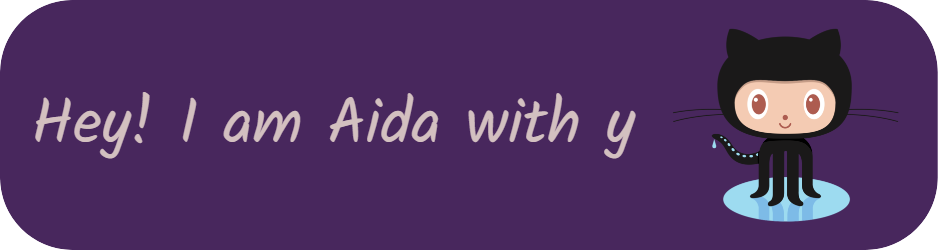

<!-- Heading -->

 <!-- About section -->

---
✨ A backend developer who has a special power in ignoring her incomplete repositories

<!-- About section: END -->

<!-- Conecct section -->

 <!-- Conecct section: END -->
 
  <!-- GitHub section -->
  <!-- Two images side by side -->

  
  
  

 ##  My GitHub Stats  

<!-- THE END -->

